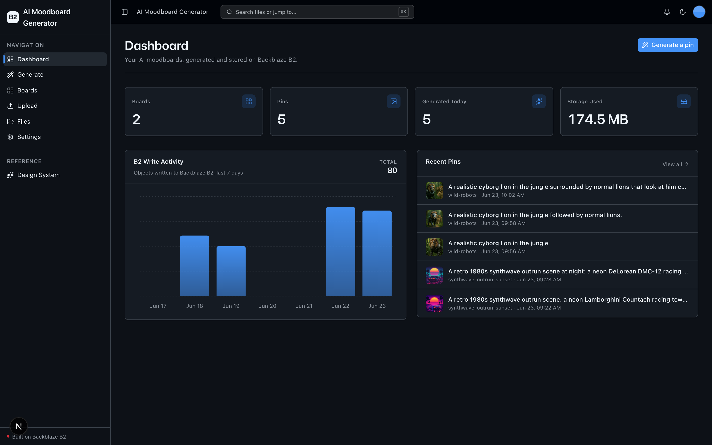
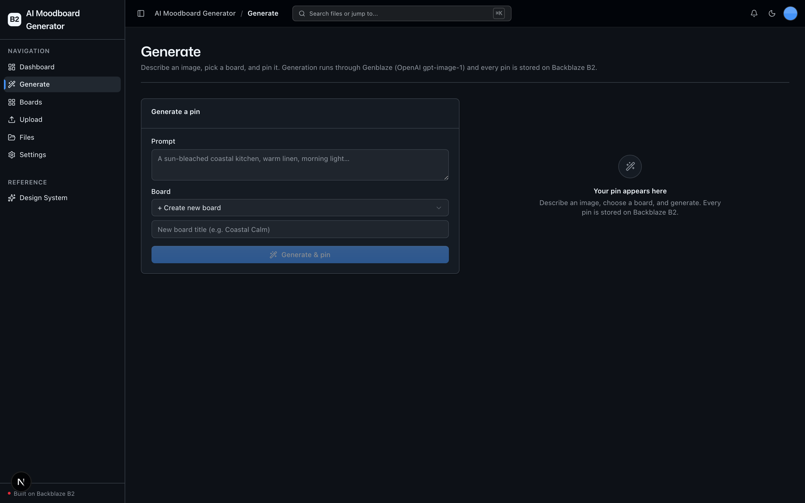
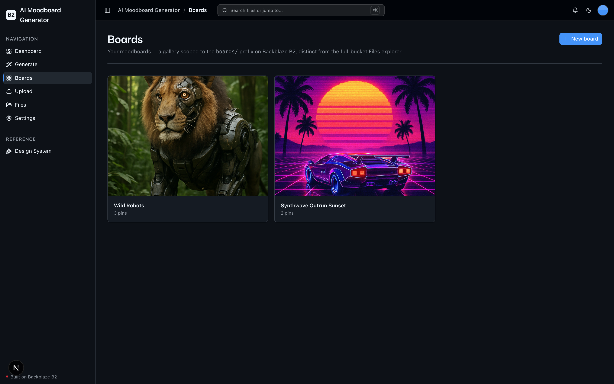
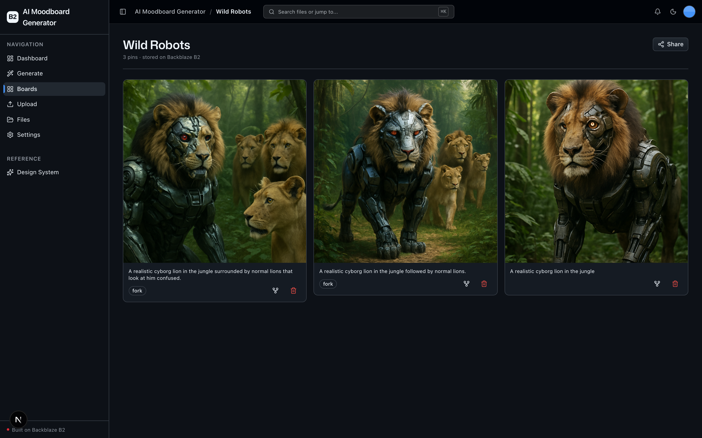

<!-- last_verified: 2026-06-23 -->
# AI Moodboard Generator

Type a prompt, pick or create a named **moodboard**, and generate an image that gets pinned to that board. Image generation runs through **Genblaze (OpenAI `gpt-image-1`)** and every pin is persisted to **[Backblaze B2](https://www.backblaze.com/sign-up/ai-cloud-storage?utm_source=github&utm_medium=referral&utm_campaign=ai_artifacts&utm_content=b2ai-oss-start)**. Clone it, add your credentials, and run it.

This is a finished B2 sample app, not a template. It's a good B2 demo because the storage economics are baked into the workflow: every pin is an image written to B2, a popular board is the same objects read back over and over, and rendering can switch between app-mediated **presigned URLs** (private bucket) and **durable public URLs** (the egress/CDN showcase) by setting a single env var. Boards are scoped to `boards/<slug>/` prefixes on B2, so the bucket layout mirrors the product. Pins also carry **fork/remix lineage** (a forked pin records its `parent`) and **provenance** (a sha256 that matches the stored bytes).

**What you get out of the box:**
- Text-to-image generation via Genblaze (OpenAI `gpt-image-1`), with selectable render quality
- Named moodboards, each scoped to its own `boards/<slug>/` prefix on B2
- Fork / remix with parent lineage and a fork badge on derived pins
- Provenance — a sha256 sidecar that matches the exact bytes stored in B2
- Two rendering modes — app-mediated presigned URLs for a private bucket, or durable public URLs when `B2_PUBLIC_URL_BASE` is set
- FastAPI backend with strict layered architecture and structural tests
- Agent-optimized docs — your AI coding agent can read the repo and start contributing immediately

## What it looks like

**Dashboard** — board and pin counts, a 7-day B2 write-activity chart, and the most recent pins.



**Generate** — describe an image, pick or create a board, and pin it; generation runs through Genblaze (OpenAI gpt-image-1) and every pin lands on Backblaze B2.



**Boards** — a gallery of your moodboards, each scoped to its own `boards/<slug>/` prefix on B2.



**Board detail** — a masonry of every pin in a board, with fork and delete actions and a shareable cover link.



## Agent-First Architecture

This repo is optimized for coding agents.

The structure follows the principle that **repository knowledge is the system of record**. Anything an agent can't access in-context doesn't exist — so everything it needs to reason about the codebase is versioned, co-located, and discoverable from the repo itself.

### How it works

**[AGENTS.md](AGENTS.md) is the single source of truth for all coding agents.** A ~100 line entry point gives agents the repository layout, architectural invariants, commands, conventions, and pointers to deeper docs. Agent-specific files (CLAUDE.md, etc.) are thin pointers back to AGENTS.md.

**Architecture is enforced mechanically, not by convention.** Layering rules, import boundaries, file size limits, and SDK containment are verified by structural tests and lints that run on every change. When rules are enforceable by code, agents follow them reliably.

**The knowledge base is structured for progressive disclosure:**

```
AGENTS.md              Single source of truth — layout, invariants, commands, conventions
ARCHITECTURE.md        System layout, layering rules, data flows
docs/
  features/            Feature docs (inputs, outputs, flows, edge cases)
  app-workflows.md     User journeys
  dev-workflows.md     Engineering workflows and testing
  SECURITY.md          Security principles
  RELIABILITY.md       Reliability expectations
  exec-plans/          Execution plans and tech debt tracker
```

### Key design decisions

| Principle | Implementation |
|-----------|---------------|
| Give agents a single source of truth | AGENTS.md ~100 lines — layout, invariants, commands, conventions |
| Enforce invariants mechanically | Structural tests + ruff + ESLint verify boundaries |
| DRY documentation | Each fact lives in one place; no redundant files to drift |
| Strict layered architecture | `types -> config -> repo -> service -> runtime`, enforced by tests |
| Prefer boring, composable libraries | stdlib logging over frameworks, Pydantic over ad-hoc validation |
| Contain external SDKs | `boto3` and the Genblaze SDK only in `repo/` — verified by structural test |
| Keep files agent-sized | 300-line limit per file, enforced by test |
| Docs updated with code | Same-PR requirement prevents documentation rot |
| Structured observability | JSON logging, `/metrics` endpoint, request tracing |

This approach draws from [OpenAI's experience building with Codex](https://openai.com/index/harness-engineering/): agents work best in environments with strict boundaries, predictable structure, and progressive context disclosure.

## Quick Start

You need: Node.js >= 20, pnpm >= 9, Python >= 3.11, an [OpenAI API key](https://platform.openai.com/api-keys) (for image generation), and a free **[Backblaze B2 account](https://www.backblaze.com/sign-up/ai-cloud-storage?utm_source=github&utm_medium=referral&utm_campaign=ai_artifacts&utm_content=b2ai-oss-start)**.

### Clone the sample

```bash
git clone https://github.com/backblaze-b2-samples/ai-moodboard-generator.git
cd ai-moodboard-generator
```

### Setup

**1. Install dependencies**

```bash
pnpm install
```

**2. Set up the backend**

```bash
cd services/api
python -m venv .venv && source .venv/bin/activate
pip install -r requirements.txt
cd ../..
```

**3. Add your credentials**

Set up your local `.env`:

```bash
cp .env.example .env
```

Open `.env` in your editor and keep it visible. Then head to the [Backblaze B2 dashboard](https://secure.backblaze.com/b2_buckets.htm?utm_source=github&utm_medium=referral&utm_campaign=ai_artifacts&utm_content=b2ai-oss-start) and:

1. **Create a bucket.** Paste its name into `.env`:
   - **Bucket Unique Name** → `B2_BUCKET_NAME`
   - Set `B2_REGION` to your bucket's region (e.g. `us-west-004`). The S3 endpoint is **derived** from it as `https://s3.<B2_REGION>.backblazeb2.com` — you set the region, not a full URL.
2. **Create an application key** with `Read and Write` permission. B2 will show two values — paste each into `.env`:
   - **keyID** → `B2_APPLICATION_KEY_ID`
   - **applicationKey** → `B2_APPLICATION_KEY` *(only shown once — paste it now)*

Then add your image-generation key and (optionally) tune the output:

- `OPENAI_API_KEY` — required; the OpenAI key Genblaze uses to drive `gpt-image-1`.
- `MOODBOARD_IMAGE_QUALITY` — optional; `low` | `medium` | `high` | `auto` (default `medium`).
- `B2_PUBLIC_URL_BASE` — optional. Leave empty for a private bucket and pins render via short-lived presigned URLs. Set it (e.g. `https://<bucket>.s3.<region>.backblazeb2.com` or a CDN host) to render pins as durable public URLs — the B2 egress/CDN showcase.

> Want a walkthrough? See the docs for [creating a bucket](https://www.backblaze.com/docs/cloud-storage-create-and-manage-buckets) and [creating app keys](https://www.backblaze.com/docs/cloud-storage-create-and-manage-app-keys).

**4. Run it**

```bash
pnpm dev
```

That's it. Frontend at `localhost:3000`, API at `localhost:8000`. Open **Generate**, type a prompt, create a board, and watch the generated image get pinned to it — the image and its provenance sidecar land under `boards/<slug>/` in your B2 bucket.

`pnpm dev` runs `pnpm doctor` first — a preflight check that catches the common setup gotchas (wrong Node/Python version, missing venv, missing or placeholder `.env`, ports already taken) and tells you exactly how to fix each one. Run it standalone any time with `pnpm doctor`.

## How it's organized

Start with **[AGENTS.md](AGENTS.md)** — it's the ~100-line map of the repository layout, architectural invariants, commands, and conventions. **[ARCHITECTURE.md](ARCHITECTURE.md)** covers the system layout, the `types -> config -> repo -> service -> runtime` layering, and the data flows (generate → persist to B2 → pin). The generate-and-pin path lives in `services/api/app/service/generate.py`; all B2 and Genblaze access is contained in `services/api/app/repo/`.

## Core Features

Feature docs live under [`docs/features/`](docs/features/):

- [Dashboard](docs/features/dashboard.md) — stats cards, B2 write-activity chart, recent pins
- [File Browser](docs/features/file-browser.md) — list, preview, download, delete objects in the bucket
- [File Upload](docs/features/file-upload.md) — direct upload to B2 with progress and metadata
- [Metadata Extraction](docs/features/metadata-extraction.md) — image dimensions, EXIF, PDF info, checksums
- [Design System](docs/design-system.md) — tokens, primitives, AI elements, the blaze generating loader, and inline `ErrorState` / `EmptyState` patterns. Live preview at `/design`.
- Inline error handling — fetch failures surface *what's wrong* (API offline, 401, 5xx) and offer a Retry, instead of silently rendering empty state.
- Single-source config — one `.env` at the repo root powers both API and web app, validated at startup so misconfig fails fast with a readable message.
- Centralized data layer — every fetch goes through TanStack Query hooks in `apps/web/src/lib/queries.ts`; cache invalidation is one call after a mutation.
- Structural tests — verify layering rules, import boundaries, SDK containment, file size limits
- Structured JSON logging — every request traced with `request_id` and timing
- `/health` endpoint — B2 connectivity check
- `/metrics` endpoint — Prometheus-format counters (request count, latency, generations)

## Tech Stack

- TypeScript, Next.js 16, React 19, Tailwind v4, shadcn/ui, Recharts
- TanStack Query — caching, dedup, retry, stale-while-revalidate for every fetch
- Python 3.11+, FastAPI, boto3, Pydantic v2, Pillow, PyPDF2
- Genblaze (`genblaze-core` + `genblaze-openai`) driving the OpenAI `gpt-image-1` image model
- Backblaze B2 (S3-compatible object storage)
- pnpm workspaces (monorepo)

## Commands

| Command | What it does |
|---------|-------------|
| `pnpm dev` | Start frontend + backend |
| `pnpm dev:web` | Frontend only |
| `pnpm dev:api` | Backend only |
| `pnpm build` | Build frontend |
| `pnpm lint` | Lint frontend |
| `pnpm lint:api` | Lint backend (ruff) |
| `pnpm test:api` | Run backend tests |
| `pnpm check:structure` | Verify layering rules |
| `pnpm test:e2e` | Playwright e2e tests (run `pnpm --filter @ai-moodboard-generator/web exec playwright install chromium` once first) |

## Documentation Map

| Doc | Purpose |
|-----|---------|
| [AGENTS.md](AGENTS.md) | Agent table of contents — start here |
| [ARCHITECTURE.md](ARCHITECTURE.md) | System layout, layering, data flows |
| [docs/features/](docs/features/) | Feature docs (dashboard, file browser, upload, metadata) |
| [docs/design-system.md](docs/design-system.md) | Design tokens, primitives, AI elements, loader, error/empty states |
| [docs/app-workflows.md](docs/app-workflows.md) | User journeys |
| [docs/dev-workflows.md](docs/dev-workflows.md) | Engineering workflows and testing |
| [docs/SECURITY.md](docs/SECURITY.md) | Security principles |
| [docs/RELIABILITY.md](docs/RELIABILITY.md) | Reliability expectations |
| [docs/exec-plans/](docs/exec-plans/) | Execution plans and tech debt tracker |

## Contributing

Start with [AGENTS.md](AGENTS.md). It's the map — everything else is discoverable from there.

## License

MIT License - see [LICENSE](LICENSE) for details.

## Claude Agent B2 Skill

Manage Backblaze B2 from your terminal using natural language (list/search, audits, stale or large file detection, security checks, safe cleanup).

Repo: [https://github.com/backblaze-b2-samples/claude-skill-b2-cloud-storage](https://github.com/backblaze-b2-samples/claude-skill-b2-cloud-storage)
